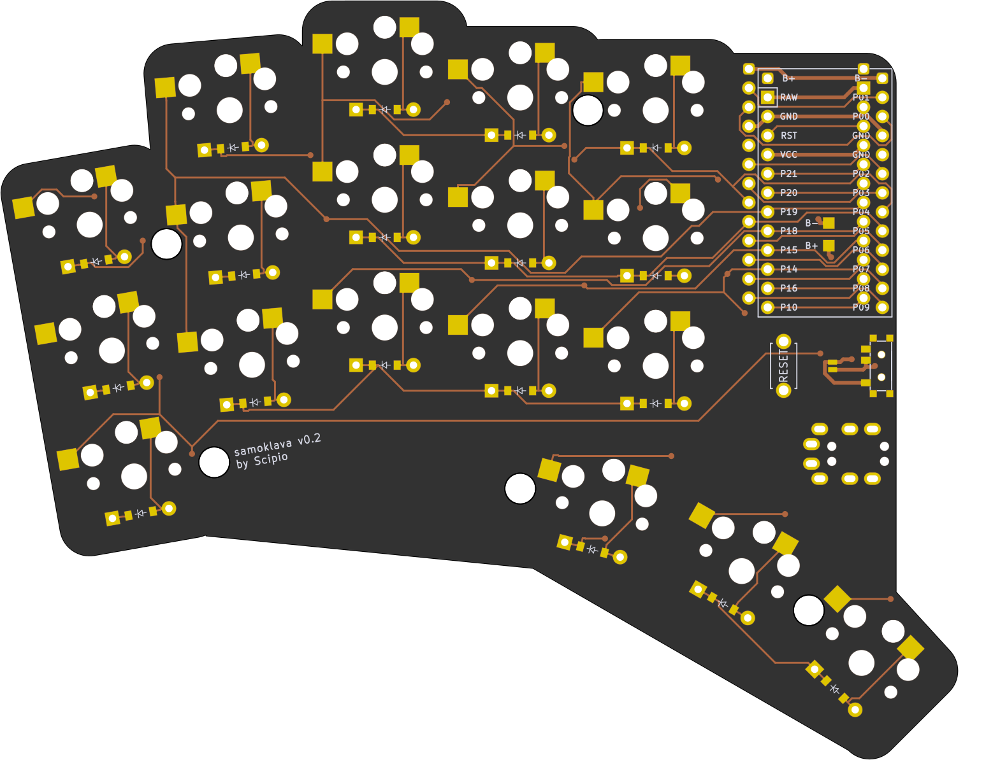
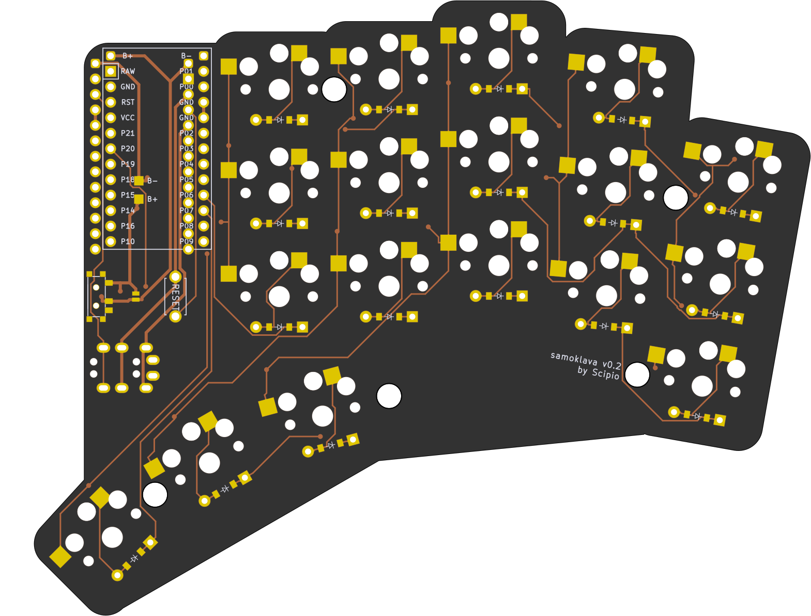

# samoklava
## An autogenerated split 36 key keyboard

left | right
-|-
 | 

A 5x3 split keyboard with 3 thumbs. There is nothing unique about the keyboard layout. It's inspired by Corne and Kyria, and
has the exact number of keys needed for the [Miryoku](https://github.com/manna-harbour/miryoku) layout.

The interesting thing about this keyboard is that it's a declarative design ("samoklava" can be loosely translated as
"keyboard that assembles itself" from Russian).
* Layout is declared using [Ergogen](https://github.com/mrzealot/ergogen/)
* The build system uses Ergogen to translate YAML to a KiCad PCB and plate files for FR-4 fab or laser cutting
* uses [kicad-automation-scripts](https://github.com/productize/kicad-automation-scripts) and [FreeRouting](https://github.com/freerouting/freerouting) to **automatically route the traces on the PCB**
* uses [KiKit](https://github.com/yaqwsx/KiKit) to render PCB previews (see top of this file) and production-ready **Gerber files**

## Features

* Extra pins and a slider switch for battery for wireless Promicro clones (tested with nice!nano); the slider can be
  shorted with a jumper if `CONFIG_ZMK_SLEEP` is preferred.
* Wired operation with QMK should be possible but is not tested; TRRS footprints are included and routed. The pinout is
  identical with a five-column Corne sans the RGBLEDs.
* Reset switches are easily accessible. The footprints used are the same as on the Corne.

## How to

If you would like to modify this:
* fork it
* change `samoklava.yaml` to your liking
* push your changes; the `build.yml` GitHub Workflow will pick it up, autoroute and generate Gerbers, all in a zip file.
  See https://github.com/soundmonster/samoklava/actions
* or:
  * make sure to have Docker CLI and NodeJS installed
  * run `make setup clean all`
  * check the `output` folder for KiCad PCBs and Gerbers

See the [workflow](.github/workflows/build.yml) or the [Makefile](Makefile) for more details.


## Test layout

* https://ergogen.cache.works/

Upload samoklava.json except pcbs section. I print on paper with dxf format on qcad and:
* edit sheet properties -> printer offset -60,-60  

## Convert output dxf to png

```
```
